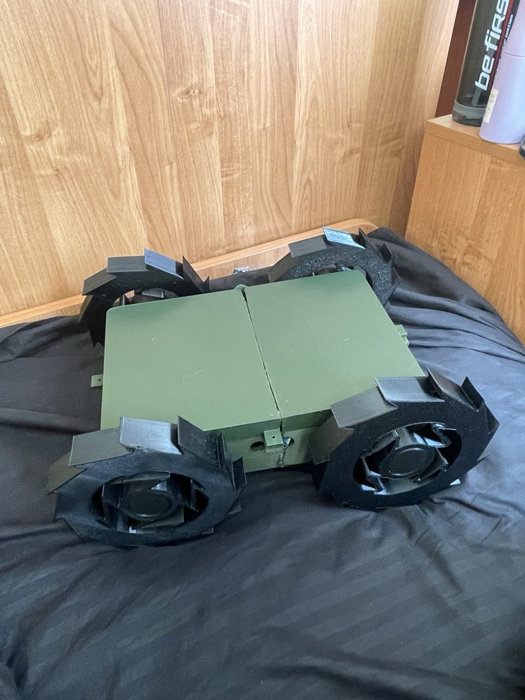
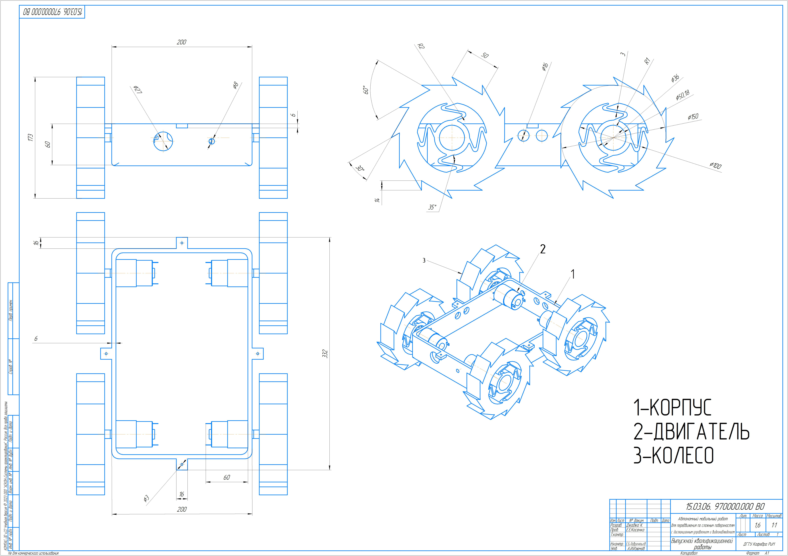
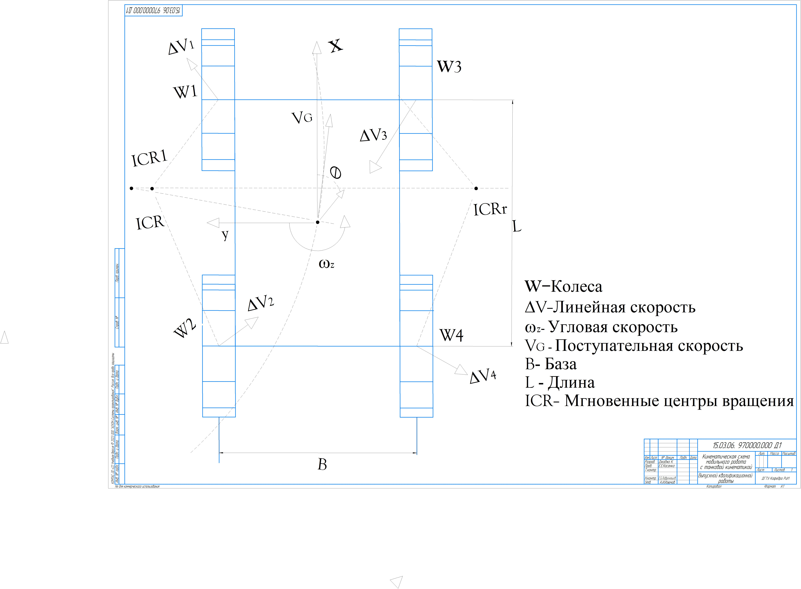
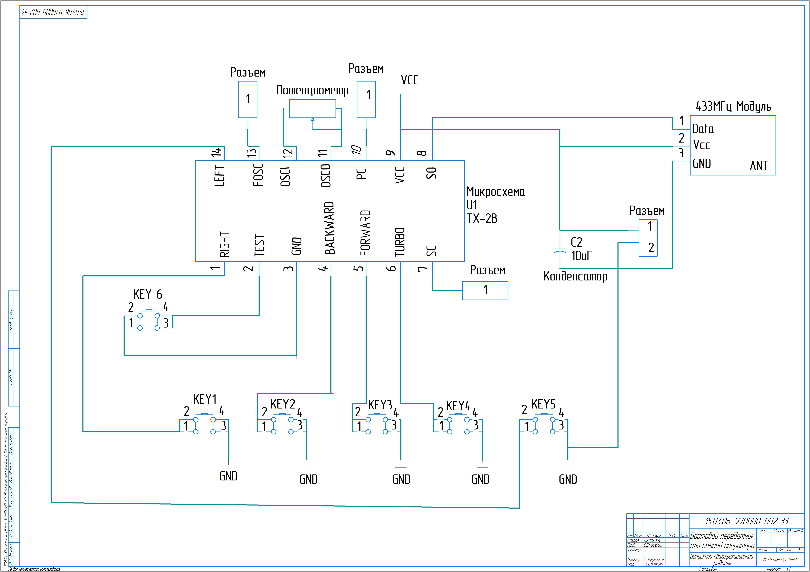
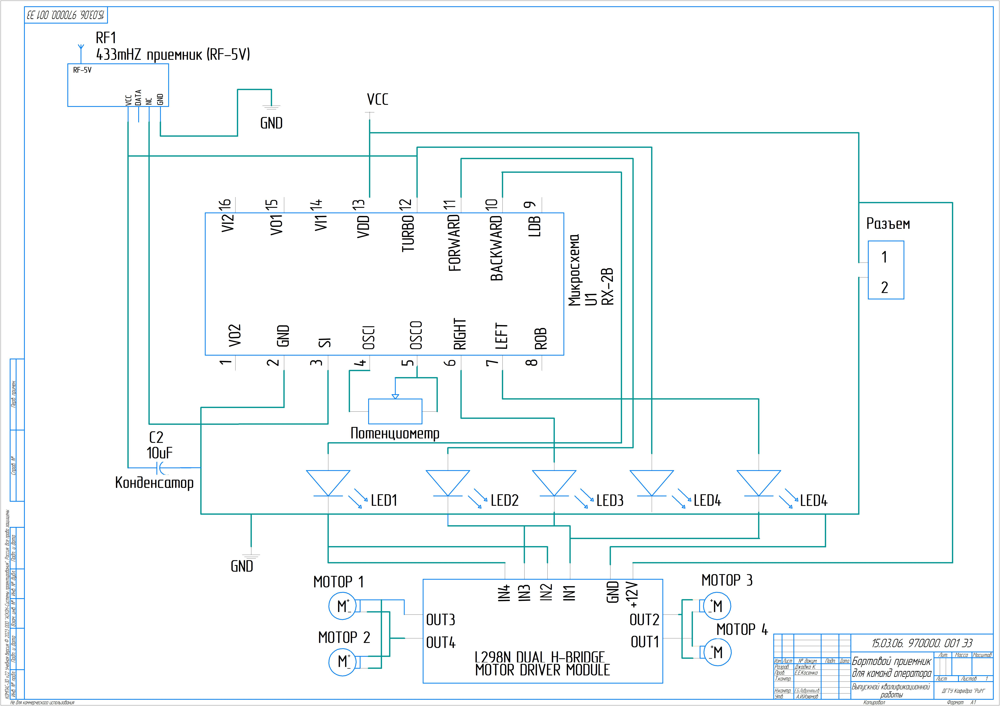
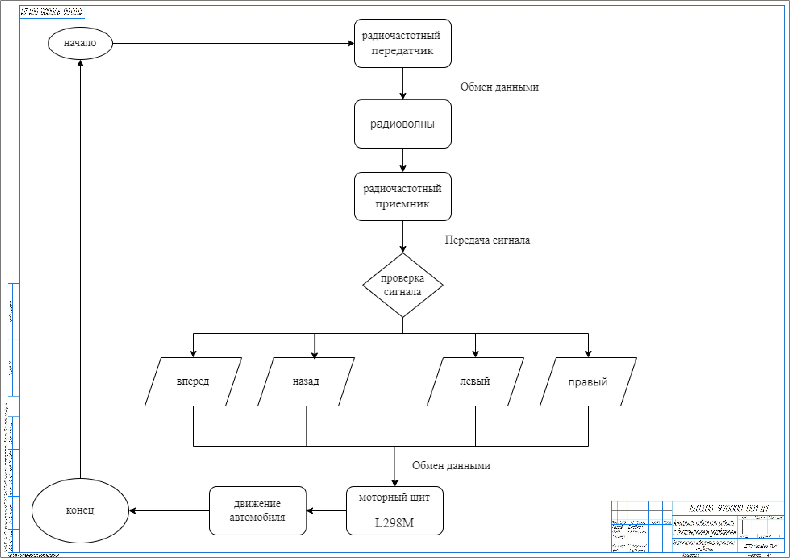

# Autonomous Mobile Robot for Rough Terrain Navigation

A fully autonomous mobile robot designed and built from scratch for my Bachelor's thesis at Don State Technical University (2024).

## Robot Photo

## What I Built
A mobile robot capable of navigating complex terrain autonomously, with remote control and live video surveillance capabilities. Every component was designed, 3D-printed, wired, and programmed by hand.

## Hardware
- Arduino Mega (main controller)
- GPS module + TinyGPS++ library
- Magnetometer (orientation sensing)
- L298N motor driver
- Ultrasonic sensor (obstacle detection)
- ESP32 camera (live video surveillance)
- Bluetooth module (SoftwareSerial)
- FM Transmitter and Receiver modules (remote control)
- 12V DC geared motors
- Custom 3D-printed chassis and terrain-specific tires

## Software
- Arduino IDE
- TinyGPS++ (GPS navigation)
- SoftwareSerial (Bluetooth communication)
- Arduino Math libraries

## Mechanical Design
- Full chassis designed in KOMPAS 3D
- Custom tire geometry designed specifically for rough terrain stability
- All components 3D-printed

## Assembly & General View

## Kinematics

## Electrical Schematics

### Transmitter Circuit

### Receiver Circuit

## Robot Behavior Algorithm

## Skills Demonstrated
- Embedded systems programming
- Electrical wiring and circuit design
- Mechanical design and 3D printing
- System integration (mechanical + electrical + software)
- GPS navigation and real-time control
